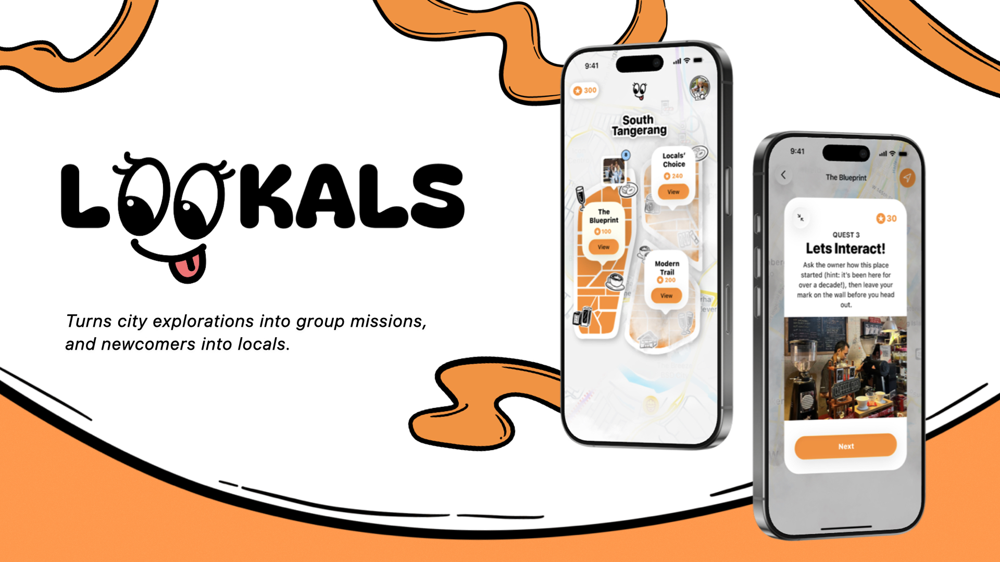

  

<strong>Turns city explorations into group missions, and newcomers into locals.</strong>

  

## What is Lookals?

**Lookals** is a location-based social exploration app for people finding their feet in a new city. It makes discovering a neighbourhood feel less like a solo checklist and more like a shared adventure.

Users join small groups on handcrafted walking tours, visit meaningful local places, and take part in simple challenges that encourage conversation. Along the way, Lookals connects local stories with shared experiences—helping newcomers build memories, friendships, and a sense of belonging.

## How it works

1. Pick a tour that matches your interests and availability.
2. Meet up with a small group and follow the route together.
3. Complete location-aware quests, challenges, and mini activities.
4. Learn about the places you visit through **Lookals Facts**.
5. Earn points, save photos or drawings, and grow from a newcomer into a local.

## Highlights

- **Handcrafted tours** — Explore curated routes built around local landmarks and stories.
- **Live navigation** — Stay together with map guidance throughout the tour.
- **Social quests** — Use interactive missions to break the ice and create shared moments.
- **Lookals Facts** — Discover the people, history, and character behind each place.
- **Memories** — Keep photos and drawings from completed adventures in a personal gallery.
- **Progress and rewards** — Collect points, unlock badges, and celebrate your journey from newcomer to Lookal.

## The idea behind it

Moving to a city does not automatically make it feel like home. Lookals is built around a simple belief: belonging grows through shared experiences with people and places. By turning exploration into a collaborative activity, the app gives people a natural way to start conversations and form lasting connections.

## Running the project

1. Open `Lookals.xcodeproj` in Xcode.
2. Choose an iPhone simulator or a connected device.
3. Run the **Lookals** scheme.

For the full experience on a device, allow location and camera access when the app asks for them.

## Built for exploration

Lookals is an iOS project created with SwiftUI. It is currently designed as an experience prototype, bringing together tours, interactive quests, maps, profiles, rewards, and memories in one friendly flow.
